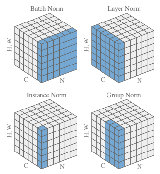

## Normalization and Regularization methods

### Problem statement:

Experiment with different normalization and regularization methods on MNIST

- Network with Group Normalization + L1
- Network with Layer Normalization + L2
- Network with BatchNorm with L1 and L2

#### Code Structure:

model.py : Contains network structure

misclassified_images.py : Contains utility function to plot misclassified images from inference on test loader.

train_test_loader.py : Contains code for train test dataloader.

trainer.py : Contains training and testing code of the network

Understanding Normalization

There are mainly three types of Normalization techniques we will be discussing:-

- Batch Normalization
- Layer Normalization
- Group Normalization

##### Batch Normalization

Rescaling the data points w.r.t each channel. 

##### Layer Normalization

Rescaling the data points w.r.t each image across all channels

##### Group Normalization

Rescaling the data points w.r.t specific group of layer in an image

##### Example

### Model learning graphs

##### Training Loss

##### 

##### Test Loss

##### Training Accuracy

##### Testing Accuracy

### Misclassified Images

#### Model 1 (Group Normalization + L1)

#### Model 2 (Layer Normalization + L2)

#### Model 3 (Batch Normalization + L1 + L2 )

