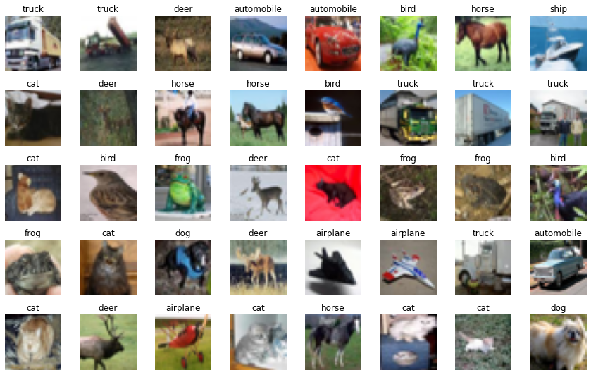
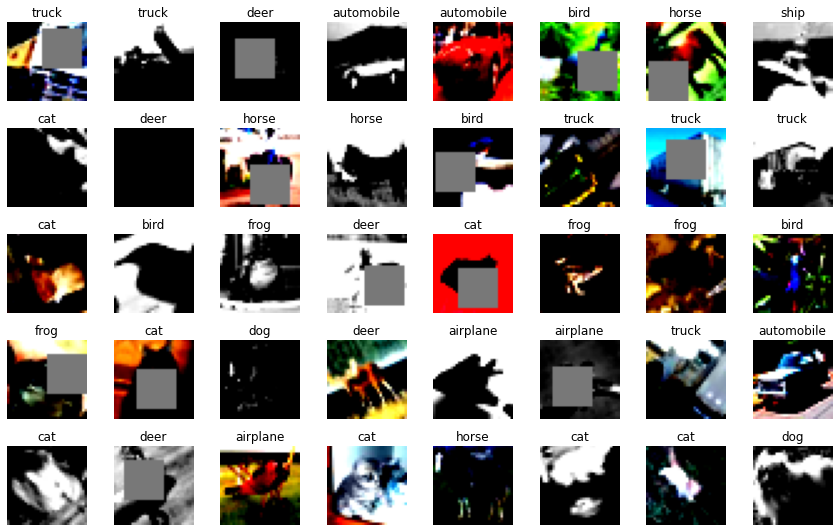
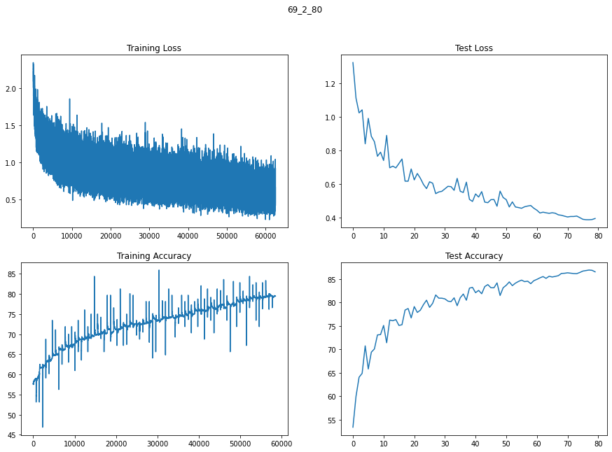
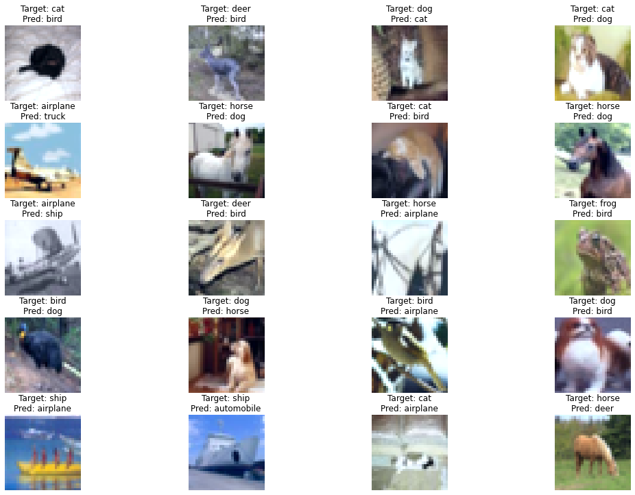

# S7  - Advance Concepts

## Target:
1. Network Design - 
    C1 | C2 | C3 | ~C4~ | O
    - No Max Pooling | No Stride of 2 | **Just Dialeted Kernels**
    - RF : 52
    - 4 Sets of Depthwise Separable Convolutions
    - 1 Dialeted Kernel

2. Augmentations, using `Albumentations`
    - horizontal flip
    - shiftScaleRotate
    - CoarseDropout (1,16,16,1,16,16, fill_value=(mean of data))
    - grayscaleHorizontal Flip 

3. **`68,992 parameters; 87% validation accuracy`**

## Data

Working with Cifar-10 dataset

**Before Augmentation and normalization**



**After Augmentation and normalization**




## Model Summary

```
----------------------------------------------------------------
        Layer (type)               Output Shape         Param #
================================================================
            Conv2d-1           [-1, 32, 32, 32]             864
              ReLU-2           [-1, 32, 32, 32]               0
       BatchNorm2d-3           [-1, 32, 32, 32]              64
            Conv2d-4           [-1, 32, 32, 32]             288
            Conv2d-5           [-1, 64, 32, 32]           2,048
              ReLU-6           [-1, 64, 32, 32]               0
       BatchNorm2d-7           [-1, 64, 32, 32]             128
            Conv2d-8           [-1, 32, 32, 32]           2,048
            Conv2d-9           [-1, 32, 32, 32]           9,216
             ReLU-10           [-1, 32, 32, 32]               0
      BatchNorm2d-11           [-1, 32, 32, 32]              64
           Conv2d-12           [-1, 32, 32, 32]             288
           Conv2d-13           [-1, 64, 32, 32]           2,048
             ReLU-14           [-1, 64, 32, 32]               0
      BatchNorm2d-15           [-1, 64, 32, 32]             128
           Conv2d-16           [-1, 64, 24, 24]          36,864
             ReLU-17           [-1, 64, 24, 24]               0
      BatchNorm2d-18           [-1, 64, 24, 24]             128
           Conv2d-19           [-1, 32, 24, 24]           2,048
           Conv2d-20           [-1, 32, 24, 24]             288
           Conv2d-21           [-1, 64, 24, 24]           2,048
             ReLU-22           [-1, 64, 24, 24]               0
      BatchNorm2d-23           [-1, 64, 24, 24]             128
           Conv2d-24           [-1, 64, 24, 24]             576
           Conv2d-25          [-1, 128, 24, 24]           8,192
             ReLU-26          [-1, 128, 24, 24]               0
      BatchNorm2d-27          [-1, 128, 24, 24]             256
AdaptiveAvgPool2d-28            [-1, 128, 1, 1]               0
           Conv2d-29             [-1, 10, 1, 1]           1,280
================================================================
Total params: 68,992
Trainable params: 68,992
Non-trainable params: 0
----------------------------------------------------------------
Input size (MB): 0.01
Forward/backward pass size (MB): 9.19
Params size (MB): 0.26
Estimated Total Size (MB): 9.46
```
1.  `68_992` parameters, with 4 depthwise separable convolutions, 1 dilated convolution.

| Layer # | Kernel | Stride | Dilation | Padding | Input | Output | RF   |
| ------- | ------ | ------ | -------- | ------- | ----- | ------ | ---- |
| 1       | 3      | 1      | 1        | 1       | 32    | 32     | 3    |
| 2       | 3      | 1      | 1        | 1       | 32    | 32     | 5    |
| 3       | 1      | 1      | 1        | 0       | 32    | 32     | 5    |
| 4       | 1      | 1      | 1        | 0       | 32    | 32     | 5    |
| 5       | 3      | 1      | 1        | 1       | 32    | 32     | 7    |
| 6       | 3      | 1      | 1        | 1       | 32    | 32     | 9    |
| 7       | 3      | 1      | 4        | 0       | 32    | 24     | 17   |
| 8       | 1      | 1      | 1        | 0       | 24    | 24     | 17   |
| 9       | 3      | 1      | 1        | 1       | 24    | 24     | 19   |
| 10      | 1      | 1      | 1        | 0       | 24    | 24     | 19   |
| 11      | 3      | 1      | 1        | 1       | 24    | 24     | 21   |
| 12      | 1      | 1      | 1        | 0       | 24    | 24     | 21   |
| 13      | 24     | 1      | 1        | 0       | 32    | 1      | 45   |


## Results
1. Validation accuracy
    a.  `85.24% in 62 epochs`
    b.  `86.52% in 80 epochs`
    
2.  Train, Validation Plots


## Mis-classified Images



## Training Logs
```
EPOCH 57 and Learning Rate [0.07774140166627344]: 
Loss=0.5452152490615845 Batch_id=781 Accuracy=75.74: 100%|██████████| 782/782 [00:18<00:00, 42.12it/s]
  0%|          | 0/782 [00:00<?, ?it/s]
Test set: Average loss: 0.4630, Accuracy: 8443/10000 (84.43%)

EPOCH 58 and Learning Rate [0.07231006616934618]: 
Loss=0.9580586552619934 Batch_id=781 Accuracy=75.71: 100%|██████████| 782/782 [00:18<00:00, 42.15it/s]
  0%|          | 0/782 [00:00<?, ?it/s]
Test set: Average loss: 0.4673, Accuracy: 8453/10000 (84.53%)

EPOCH 59 and Learning Rate [0.066965854707087]: 
Loss=1.0038752555847168 Batch_id=781 Accuracy=75.87: 100%|██████████| 782/782 [00:18<00:00, 42.03it/s]
  0%|          | 0/782 [00:00<?, ?it/s]
Test set: Average loss: 0.4704, Accuracy: 8400/10000 (84.00%)

EPOCH 60 and Learning Rate [0.06172558214592398]: 
Loss=0.9688518047332764 Batch_id=781 Accuracy=76.45: 100%|██████████| 782/782 [00:18<00:00, 41.81it/s]
  0%|          | 0/782 [00:00<?, ?it/s]
Test set: Average loss: 0.4543, Accuracy: 8463/10000 (84.63%)

EPOCH 61 and Learning Rate [0.056605736322048614]: 
Loss=0.5355124473571777 Batch_id=781 Accuracy=76.35: 100%|██████████| 782/782 [00:18<00:00, 41.30it/s]
  0%|          | 0/782 [00:00<?, ?it/s]
Test set: Average loss: 0.4425, Accuracy: 8491/10000 (84.91%)

EPOCH 62 and Learning Rate [0.05162242616458335]: 
Loss=1.125573754310608 Batch_id=781 Accuracy=76.73: 100%|██████████| 782/782 [00:18<00:00, 41.84it/s]
  0%|          | 0/782 [00:00<?, ?it/s]
Test set: Average loss: 0.4258, Accuracy: 8524/10000 (85.24%)

EPOCH 63 and Learning Rate [0.04679133101093077]: 
Loss=1.1463186740875244 Batch_id=781 Accuracy=77.02: 100%|██████████| 782/782 [00:18<00:00, 41.67it/s]
  0%|          | 0/782 [00:00<?, ?it/s]
Test set: Average loss: 0.4307, Accuracy: 8551/10000 (85.51%)

EPOCH 64 and Learning Rate [0.04212765127377732]: 
Loss=1.1184437274932861 Batch_id=781 Accuracy=77.15: 100%|██████████| 782/782 [00:18<00:00, 42.16it/s]
  0%|          | 0/782 [00:00<?, ?it/s]
Test set: Average loss: 0.4269, Accuracy: 8513/10000 (85.13%)

EPOCH 65 and Learning Rate [0.037646060614971416]: 
Loss=0.6193357110023499 Batch_id=781 Accuracy=76.72: 100%|██████████| 782/782 [00:18<00:00, 41.75it/s]
  0%|          | 0/782 [00:00<?, ?it/s]
Test set: Average loss: 0.4240, Accuracy: 8558/10000 (85.58%)

EPOCH 66 and Learning Rate [0.03336065977675451]: 
Loss=0.46617552638053894 Batch_id=781 Accuracy=77.40: 100%|██████████| 782/782 [00:18<00:00, 41.72it/s]
  0%|          | 0/782 [00:00<?, ?it/s]
Test set: Average loss: 0.4273, Accuracy: 8542/10000 (85.42%)

EPOCH 67 and Learning Rate [0.029284932215609218]: 
Loss=1.0805134773254395 Batch_id=781 Accuracy=77.50: 100%|██████████| 782/782 [00:18<00:00, 42.20it/s]
  0%|          | 0/782 [00:00<?, ?it/s]
Test set: Average loss: 0.4245, Accuracy: 8555/10000 (85.55%)

EPOCH 68 and Learning Rate [0.02543170167831689]: 
Loss=0.5218173265457153 Batch_id=781 Accuracy=77.74: 100%|██████████| 782/782 [00:18<00:00, 41.29it/s]
  0%|          | 0/782 [00:00<?, ?it/s]
Test set: Average loss: 0.4148, Accuracy: 8570/10000 (85.70%)

EPOCH 69 and Learning Rate [0.021813091853705845]: 
Loss=0.5977577567100525 Batch_id=781 Accuracy=78.02: 100%|██████████| 782/782 [00:18<00:00, 41.72it/s]
  0%|          | 0/782 [00:00<?, ?it/s]
Test set: Average loss: 0.4122, Accuracy: 8617/10000 (86.17%)

EPOCH 70 and Learning Rate [0.018440488227041]: 
Loss=0.6212405562400818 Batch_id=781 Accuracy=78.13: 100%|██████████| 782/782 [00:18<00:00, 41.58it/s]
  0%|          | 0/782 [00:00<?, ?it/s]
Test set: Average loss: 0.4070, Accuracy: 8621/10000 (86.21%)

EPOCH 71 and Learning Rate [0.015324502257075004]: 
Loss=0.819345235824585 Batch_id=781 Accuracy=78.16: 100%|██████████| 782/782 [00:18<00:00, 41.28it/s]
  0%|          | 0/782 [00:00<?, ?it/s]
Test set: Average loss: 0.4022, Accuracy: 8631/10000 (86.31%)

EPOCH 72 and Learning Rate [0.012474937988473146]: 
Loss=0.42450496554374695 Batch_id=781 Accuracy=78.68: 100%|██████████| 782/782 [00:18<00:00, 41.79it/s]
  0%|          | 0/782 [00:00<?, ?it/s]
Test set: Average loss: 0.4050, Accuracy: 8623/10000 (86.23%)

EPOCH 73 and Learning Rate [0.009900761204661693]: 
Loss=0.8377923369407654 Batch_id=781 Accuracy=78.97: 100%|██████████| 782/782 [00:18<00:00, 41.73it/s]
  0%|          | 0/782 [00:00<?, ?it/s]
Test set: Average loss: 0.4049, Accuracy: 8615/10000 (86.15%)

EPOCH 74 and Learning Rate [0.007610071218156189]: 
Loss=0.3178037405014038 Batch_id=781 Accuracy=79.23: 100%|██████████| 782/782 [00:18<00:00, 41.45it/s]
  0%|          | 0/782 [00:00<?, ?it/s]
Test set: Average loss: 0.4076, Accuracy: 8613/10000 (86.13%)

EPOCH 75 and Learning Rate [0.005610075387127873]: 
Loss=0.6278717517852783 Batch_id=781 Accuracy=79.13: 100%|██████████| 782/782 [00:18<00:00, 42.04it/s]
  0%|          | 0/782 [00:00<?, ?it/s]
Test set: Average loss: 0.3981, Accuracy: 8638/10000 (86.38%)

EPOCH 76 and Learning Rate [0.003907066438388321]: 
Loss=0.6552791595458984 Batch_id=781 Accuracy=79.16: 100%|██████████| 782/782 [00:18<00:00, 41.45it/s]
  0%|          | 0/782 [00:00<?, ?it/s]
Test set: Average loss: 0.3883, Accuracy: 8668/10000 (86.68%)

EPOCH 77 and Learning Rate [0.0025064026681429217]: 
Loss=0.42427679896354675 Batch_id=781 Accuracy=79.14: 100%|██████████| 782/782 [00:18<00:00, 41.58it/s]
  0%|          | 0/782 [00:00<?, ?it/s]
Test set: Average loss: 0.3858, Accuracy: 8679/10000 (86.79%)

EPOCH 78 and Learning Rate [0.0014124910828085392]: 
Loss=0.22607332468032837 Batch_id=781 Accuracy=79.36: 100%|██████████| 782/782 [00:18<00:00, 41.59it/s]
  0%|          | 0/782 [00:00<?, ?it/s]
Test set: Average loss: 0.3856, Accuracy: 8690/10000 (86.90%)

EPOCH 79 and Learning Rate [0.0006287735329409451]: 
Loss=0.6430982351303101 Batch_id=781 Accuracy=79.58: 100%|██████████| 782/782 [00:18<00:00, 41.53it/s]
  0%|          | 0/782 [00:00<?, ?it/s]
Test set: Average loss: 0.3869, Accuracy: 8684/10000 (86.84%)

EPOCH 80 and Learning Rate [0.00015771588389959499]: 
Loss=0.6595807075500488 Batch_id=781 Accuracy=79.43: 100%|██████████| 782/782 [00:18<00:00, 41.97it/s]

Test set: Average loss: 0.3931, Accuracy: 8652/10000 (86.52%)
```

## Observations
1.  So far, from experiments looks like going for high Receptive Field doesn't help if images don't have a lot of backgrounds.
2.  Depthwise separable convolutions are great to keep parameters low.
3.  There is only one way to go, one cycle LR
