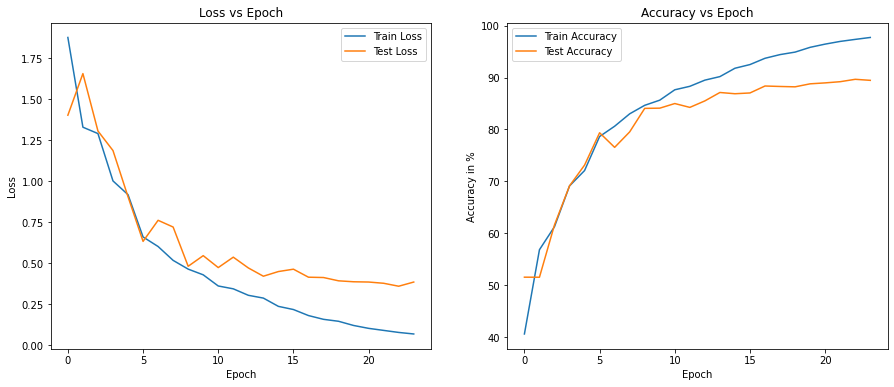
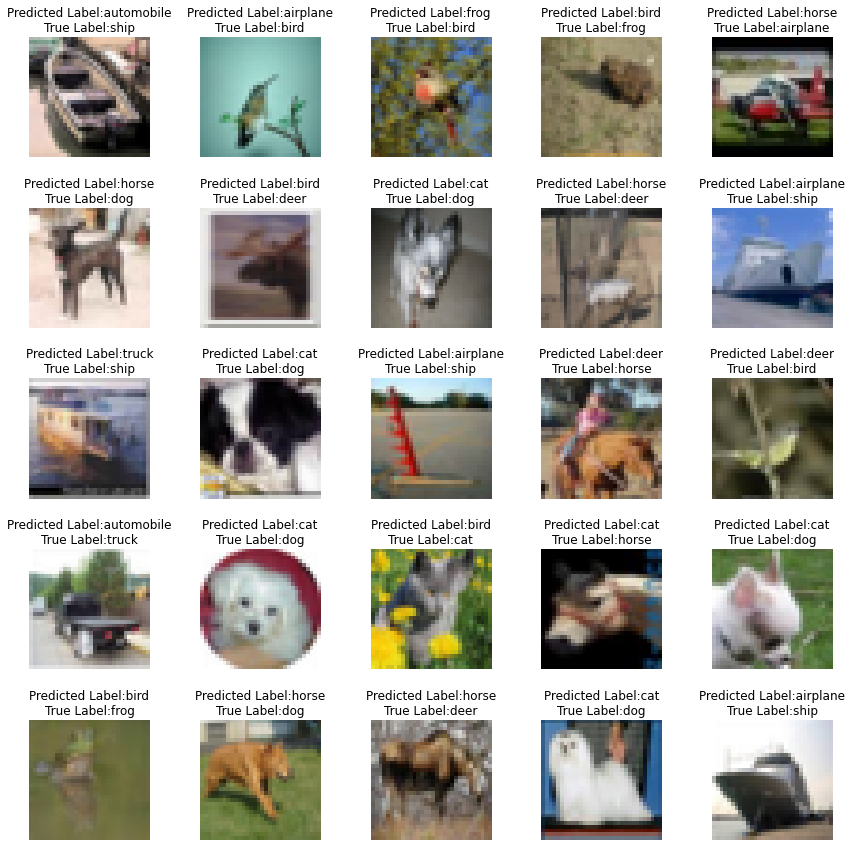
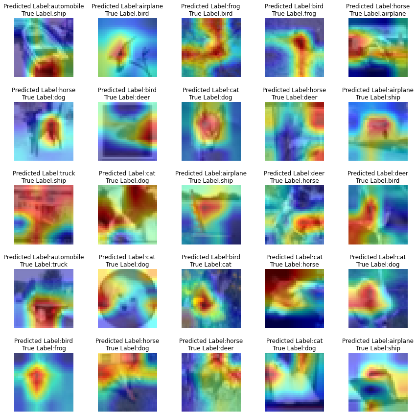

# Resnets and Higher Receptive Fields

The objective of this assignment is to design a custom Resnet model, to identify the best possible Learning rate and implement One Cycle LR scheduler to quickly train the model. The following changes are implemented- 

Mixed Resnet model - a new resnet architecture with Convolution+Maxpool in every layer and resnet blocks in alternate layers.

One Cycle policy- a learning technique where the learning rate goes from lower learning rate (1/5th or 1/10th of the max learning rate) to higher learning rate in one half of the cycle. In the second half of the cycle, the model's LR comes back to the lower learning rate.

The motivation behind this is that, during the middle of learning when the learning rate is higher, the learning rate works as a regularisation method and keep the network from overfitting. This helps the network to avoid steep areas of loss and land better flatter minima.

## Model Hyperparameters

* Optimizer: SGD
* Loss Function: Cross Entropy Loss
* Batch Size: 512
* Epochs: 24

* LR Scheduler - One Cycle Policy

  min LR = 0.002

  max LR = 0.02

  Steps per epoch = 98

  Epochs to reach max LR = 5
## Model Summary

```
----------------------------------------------------------------
        Layer (type)               Output Shape         Param #
================================================================
            Conv2d-1           [-1, 64, 32, 32]           1,728
       BatchNorm2d-2           [-1, 64, 32, 32]             128
              ReLU-3           [-1, 64, 32, 32]               0
            Conv2d-4          [-1, 128, 32, 32]          73,728
         MaxPool2d-5          [-1, 128, 16, 16]               0
       BatchNorm2d-6          [-1, 128, 16, 16]             256
              ReLU-7          [-1, 128, 16, 16]               0
            Conv2d-8          [-1, 128, 16, 16]         147,456
       BatchNorm2d-9          [-1, 128, 16, 16]             256
             ReLU-10          [-1, 128, 16, 16]               0
           Conv2d-11          [-1, 128, 16, 16]         147,456
      BatchNorm2d-12          [-1, 128, 16, 16]             256
             ReLU-13          [-1, 128, 16, 16]               0
       BasicBlock-14          [-1, 128, 16, 16]               0
           Conv2d-15          [-1, 256, 16, 16]         294,912
        MaxPool2d-16            [-1, 256, 8, 8]               0
      BatchNorm2d-17            [-1, 256, 8, 8]             512
             ReLU-18            [-1, 256, 8, 8]               0
       BasicBlock-19            [-1, 256, 8, 8]               0
           Conv2d-20            [-1, 512, 8, 8]       1,179,648
        MaxPool2d-21            [-1, 512, 4, 4]               0
      BatchNorm2d-22            [-1, 512, 4, 4]           1,024
             ReLU-23            [-1, 512, 4, 4]               0
           Conv2d-24            [-1, 512, 4, 4]       2,359,296
      BatchNorm2d-25            [-1, 512, 4, 4]           1,024
             ReLU-26            [-1, 512, 4, 4]               0
           Conv2d-27            [-1, 512, 4, 4]       2,359,296
      BatchNorm2d-28            [-1, 512, 4, 4]           1,024
             ReLU-29            [-1, 512, 4, 4]               0
       BasicBlock-30            [-1, 512, 4, 4]               0
           Linear-31                   [-1, 10]           5,130
================================================================
Total params: 6,573,130
Trainable params: 6,573,130
Non-trainable params: 0
----------------------------------------------------------------
Input size (MB): 0.01
Forward/backward pass size (MB): 6.88
Params size (MB): 25.07
Estimated Total Size (MB): 31.96
----------------------------------------------------------------
```


## Results

### Training loss/accuracy trend across normalization vs epochs



### Misclassified Images

Below are the list of missclassifed images with their correct and predicted labels

.


### GradCAM on misclassified images

Below is the class activation mapping for misclassified images. The activation generated is with respect to the class predicted by the model.

